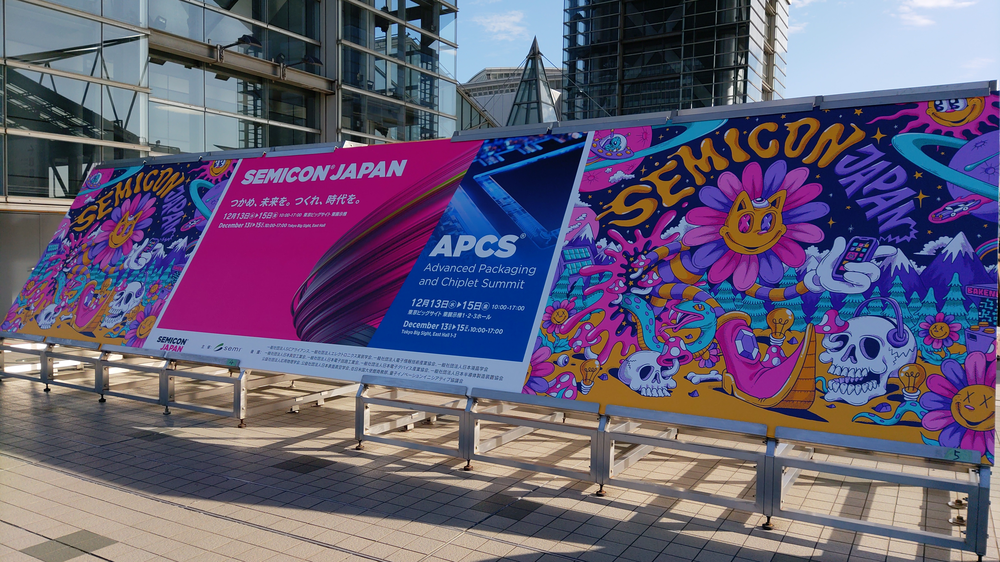
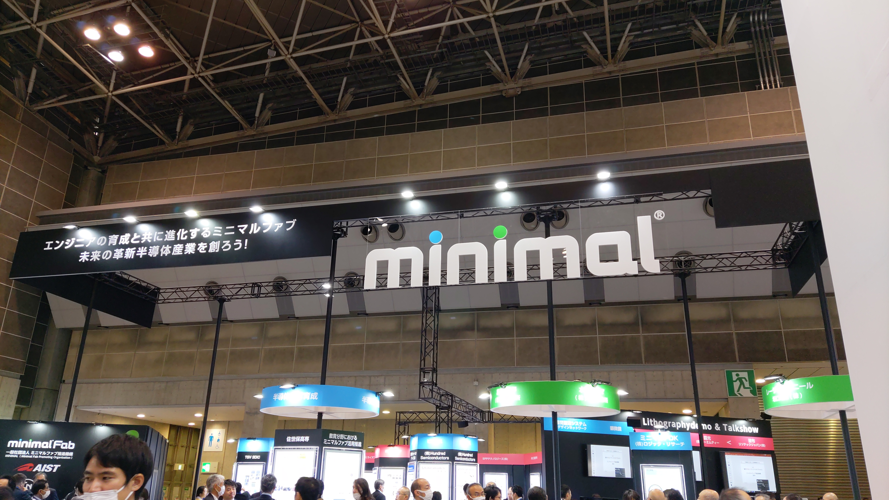
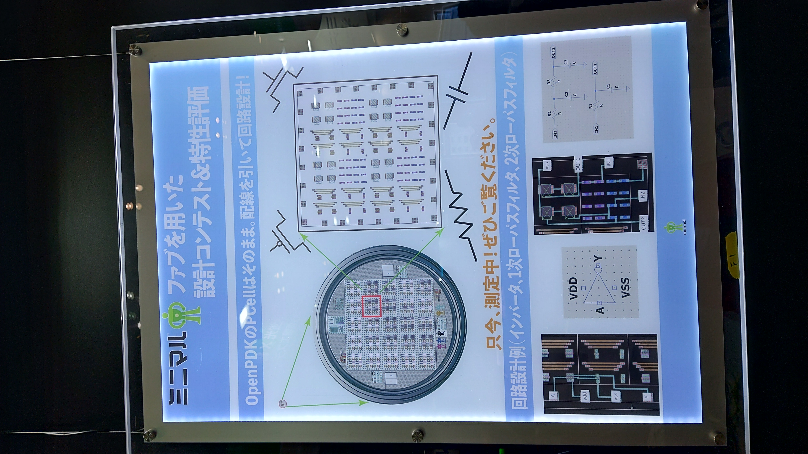
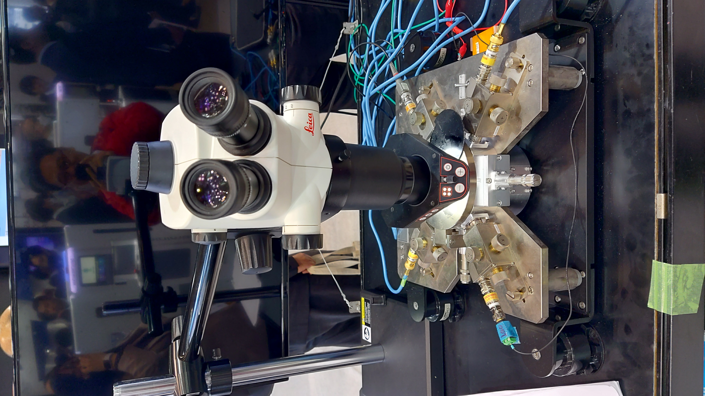
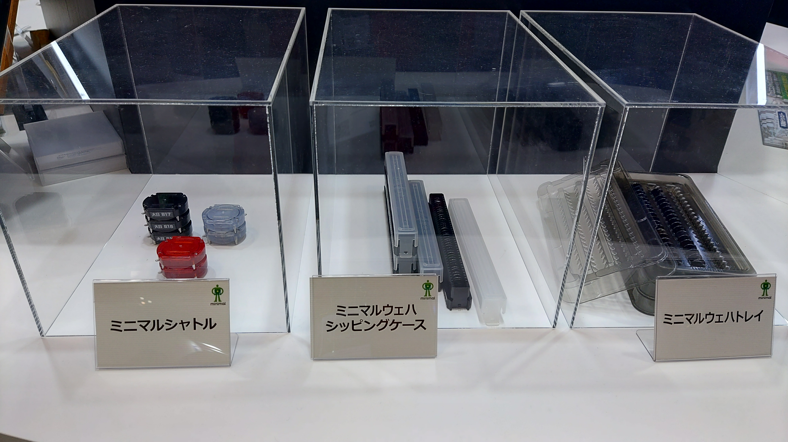
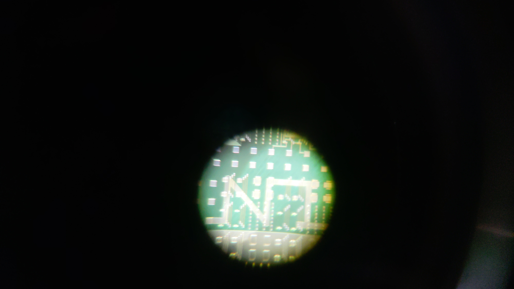
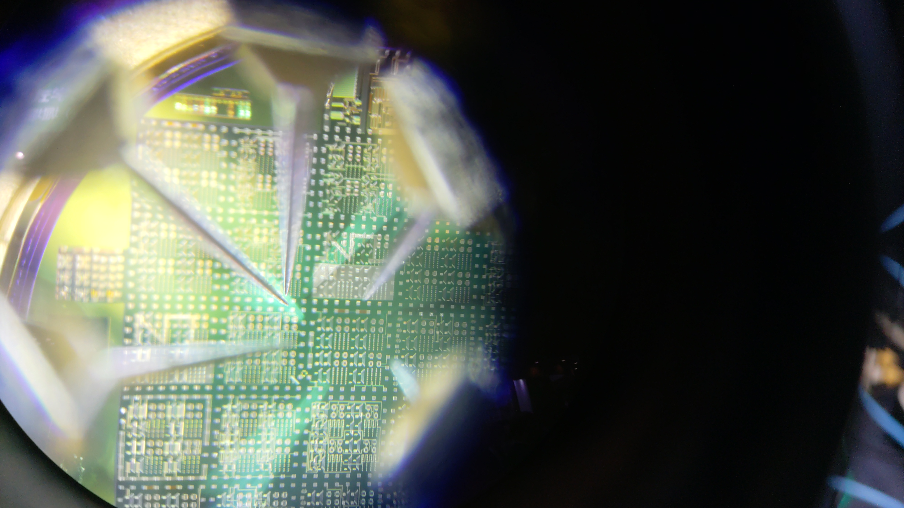

# [オープンソースPDK（Process Design Kit） Advent Calendar 2023 の 14日目](https://qiita.com/advent-calendar/2023/opensource-pdk)の記事です。

[セミコンジャパンデザインコンテスト2023](https://www.anagix.com/nyusu/%E3%82%BB%E3%83%9F%E3%82%B3%E3%83%B3%E3%82%B8%E3%83%A3%E3%83%91%E3%83%B32023%E3%81%AB%E5%90%91%E3%81%91%E3%81%9F%E3%83%9F%E3%83%8B%E3%83%9E%E3%83%AB%E3%83%95%E3%82%A1%E3%83%96%E8%A8%AD%E8%A8%88%E3%82%B3%E3%83%B3%E3%83%86%E3%82%B9%E3%83%88%E9%96%8B%E5%82%AC)への応募した[Burning Silicon Accessory](https://github.com/noritsuna/Burning_Silicon_Accessory)のSilicon出来たとのことで、セミコンジャパン2023のミニマルファブブースへ見に行ってきました！

# ブツ
早速ブース内を探索すると、、、ありました！ここに展示されているようです。

どうやら、ここで実物のSiliconを見られるようです。

あった！ありました！！！我がイニシャルN.Iの文字が！！！

あとは、このSiliconをどうにか手に入れて、燃やすだけだぜ！！！

以上、お粗末様でした。
